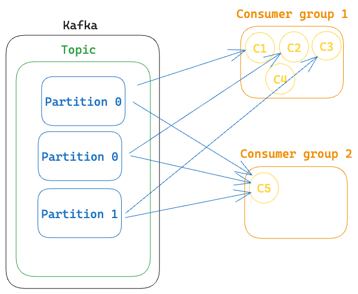
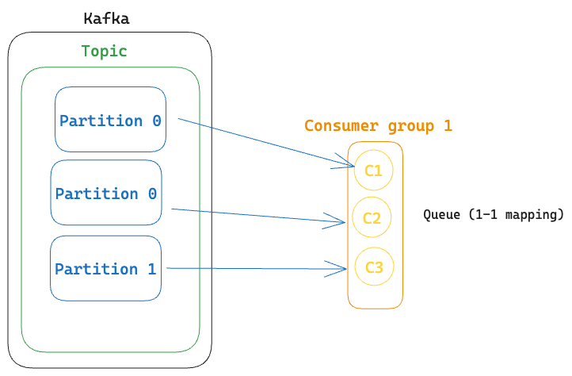
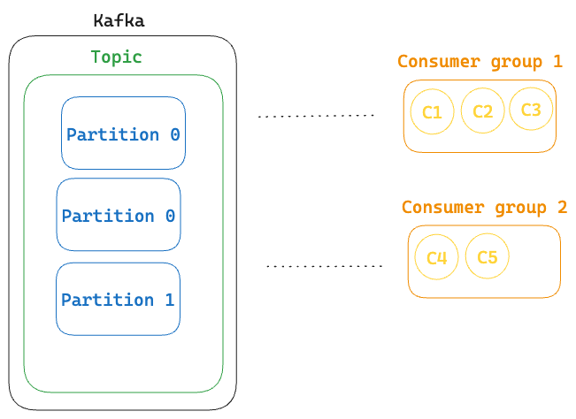

# Kafka Concepts (WIP)

Kafka is a reliable and efficient way for different computer programs to send and receive messages, making it easier for them to work together and share information.

**What problem does kafka solve?**

- distributed streaming platform
- distributed commit log
- distributed publish-subscribe messaging system
- distributed storage system

Suppose you are assigned a task to design a `Rider Location Tracking` system for a food delivery app. In this app, we want to show customers the live location of their delivery rider. To do this, we need to constantly update and share the rider's location.

One way to do this is by sending the rider's location to a central database every second and then fetching it from the database to show on the customer's app. However, as the system scales with many riders and customers, this approach becomes inefficient because databases have limits on how quickly they can handle data. We can rephrase this in a more formal way, 'databases are not optimized for high throughput'.

Here, Kafka comes to the rescue because it can handle a large number of messages very quickly.

In Kafka, data is organized into "topics," which are like categories for messages.

Each topic is divided into "partitions," which are ordered and replicated copies of the data.

Producers decide which partition a message goes to.

If you have multiple consumers, Kafka automatically balances the work.

- If there are four partitions and one consumer, then the consumer will read from all the four partitions.
- If there are four partitionas and two consumers, then each consumer will read from two partitions
- If there are four partitions and three consumers, then one consumer will read from two partitions and the other two consumers will read from one partition each.
- If there are four partitions and four consumers, then each consumer will read from one partition.
- If there are four partitions and five consumers, then one consumer will be idle.

**1 consumer can consume from multiple partitions. But 1 partition can be consumed by only 1 consumer.**

To solve this problem, consumer groups are used.

Kafka will balance the partitions between the consumers in a group. If a consumer fails, the partitions assigned to it will be assigned to other consumers in the group.

### Queue vs. Pub-Sub:

In traditional message systems, there are two main models: queues and pub-sub (publish-subscribe).

Queues have one producer and one consumer, while pub-sub has one producer and many consumers.

#### Kafka as a Queue:

To make Kafka behave like a queue, you can create a consumer group with the same number of consumers as there are partitions.
This way, there's a one-to-one connection between consumers and partitions.

### Kafka as Pub-Sub:

To achieve pub-sub behavior in Kafka, you simply create more consumer groups.

Each consumer group represents a group of subscribers, allowing multiple consumers to receive the same messages.

